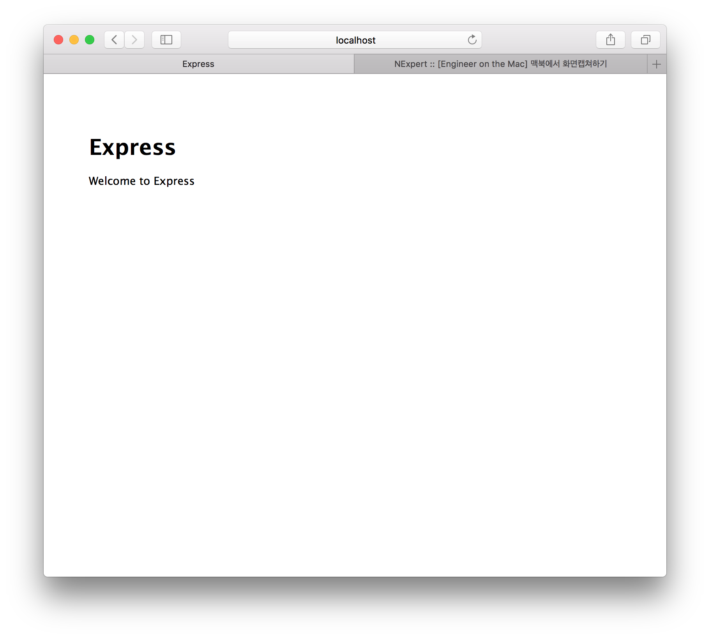
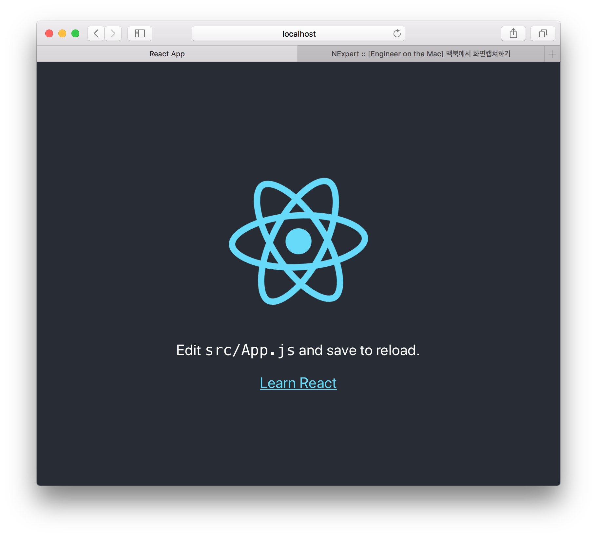

1. install nodejs & express
    > apk update && apk add nodejs && apk add npm  
    > npm install express-generator -g  
    > express --view=pug express-app

2. install react
    > npx create-react-app react-app  
    > npm start
